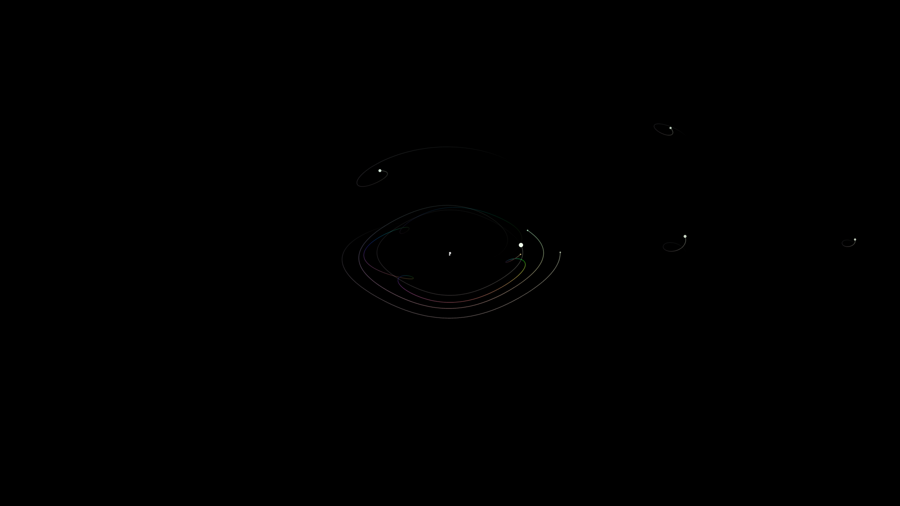

# Solar Background Wallpaper Automation (Windows)

This project generates a geocentric solar system image and can automatically set it as your desktop wallpaper on a schedule.

The render now also includes the dwarf planets above 500 km radius: Pluto, Eris, Haumea, Makemake, Gonggong, and Quaoar.

## Example Output


config.py: ORBIT_RADIUS_MODE = "sqrt", pitch = 70

## What This Setup Gives You

- A scheduled task named `SolarWallpaperAutoUpdate`
- Automatic wallpaper updates every 6 hours (default)
- Hidden/background execution (no PowerShell window pop-up)

## Prerequisites

- Windows 10 or Windows 11
- PowerShell 5.1+ (built-in on Windows)
- Python installed (3.10+ recommended)

## First-Time Setup

### 1) Open PowerShell in this folder

In File Explorer, open this project folder, then:

- Shift + right click in the folder background
- Select "Open PowerShell window here" (or open terminal in VS Code)

### 2) Create and activate virtual environment

```powershell
python -m venv .venv
.\.venv\Scripts\Activate.ps1
```

If activation is blocked, run:

```powershell
Set-ExecutionPolicy -Scope CurrentUser RemoteSigned
```

Then activate again:

```powershell
.\.venv\Scripts\Activate.ps1
```

### 3) Install Python dependencies

```powershell
pip install -r requirements.txt
```

### 4) Test one manual run

```powershell
.\run_wallpaper.ps1 -VerboseLog
```

Expected result:

- `geocentric.png` is generated/updated
- Wallpaper updates

### 5) Register the scheduled task (recommended: elevated PowerShell)

Run PowerShell as Administrator, then run:

```powershell
cd "C:\Users\sbrad\Documents\Solar Background"
.\setup_wallpaper_scheduler.ps1 -TaskName "SolarWallpaperAutoUpdate" -IntervalHours 6 -MainArgs "--pitch=70"
```

Notes:

- `-IntervalHours 6` means update every 6 hours
- `-MainArgs "--pitch=70"` passes rendering args to `main.py`
- You can change interval/args later by re-running the same command

## Verify Task Setup

### Check task action and hidden mode

```powershell
Get-ScheduledTask -TaskName "SolarWallpaperAutoUpdate" | Select-Object -ExpandProperty Actions
```

Expected key values:

- Execute: `C:\Windows\System32\wscript.exe`
- Arguments include: `run_wallpaper_hidden.vbs`

This indicates hidden/windowless execution.

### Start task immediately

```powershell
Start-ScheduledTask -TaskName "SolarWallpaperAutoUpdate"
```

### Check last run status

```powershell
Get-ScheduledTaskInfo -TaskName "SolarWallpaperAutoUpdate"
```

- `LastTaskResult = 0` means success

## Common Commands

### Update task settings

```powershell
.\setup_wallpaper_scheduler.ps1 -TaskName "SolarWallpaperAutoUpdate" -IntervalHours 3 -MainArgs "--pitch=70"
```

### Run once manually

```powershell
.\run_wallpaper.ps1 -VerboseLog
```

### Remove task

```powershell
.\setup_wallpaper_scheduler.ps1 -TaskName "SolarWallpaperAutoUpdate" -Uninstall
```

## Troubleshooting

### "Access is denied" when creating/updating task

- Open PowerShell as Administrator and run setup again

### Task runs but wallpaper does not change

1. Run once manually:

```powershell
.\run_wallpaper.ps1 -VerboseLog
```

2. Confirm output image exists:

```powershell
Test-Path .\geocentric.png
```

3. Check task action points to `wscript.exe` + `run_wallpaper_hidden.vbs`

### PowerShell window still appears

- Re-run setup to refresh the task action
- Verify action uses `wscript.exe` and not direct `powershell.exe`

## Key Files

- `run_wallpaper.ps1`: Generate image and apply wallpaper
- `set_geocentric_wallpaper.ps1`: Set Windows wallpaper
- `run_wallpaper_hidden.vbs`: Hidden launcher used by Task Scheduler
- `setup_wallpaper_scheduler.ps1`: Install/update/remove scheduled task
- `wallpaper_scheduler_config.json`: Stored scheduler options (interval/args)

## Complete Argument Reference

This project has three command entry points with arguments:

- `main.py` (render options)
- `run_wallpaper.ps1` (manual runner wrapper)
- `setup_wallpaper_scheduler.ps1` (task install/update/remove)

### 1) `main.py` arguments

Run directly:

```powershell
python .\main.py [args]
```

Arguments:

- `--labels`
	- Type: boolean (`True`/`False`)
	- Default: `False`
	- Effect: show body labels when present
- `--width`
	- Type: integer
	- Default: `2560`
	- Effect: output image width in pixels
- `--height`
	- Type: integer
	- Default: `1440`
	- Effect: output image height in pixels
- `--yaw`
	- Type: float
	- Default: `0.0`
	- Effect: view yaw rotation in degrees
- `--pitch`
	- Type: float
	- Default: `0.0`
	- Effect: view pitch rotation in degrees
- `--roll`
	- Type: float
	- Default: `0.0`
	- Effect: view roll rotation in degrees
- `--ssaa`
	- Type: integer
	- Default: `4`
	- Effect: supersampling anti-aliasing scale (higher = smoother but slower)
- `--inner-planets`
	- Type: boolean (`True`/`False`)
	- Default: `False`
	- Effect: render only Mercury, Venus, Earth, and Mars
- `--planets`
	- Type: boolean (`True`/`False`)
	- Default: `False`
	- Effect: render Sun, Moon, and the 8 major planets (excludes dwarf planets)
	- Note: if both `--planets` and `--inner-planets` are present, `--planets` takes precedence
- `--celestial-scale`
	- Type: boolean (`True`/`False`)
	- Default: uses `SHOW_CELESTIAL_SCALE` from `config.py`
	- Effect: enable or disable celestial guide circles at runtime
- `--dynamic-saturation`
	- Type: boolean (`True`/`False`)
	- Default: uses `TRAIL_DYNAMIC_SATURATION` from `config.py`
	- Effect: when `False`, skips dynamic saturation and uses full saturation (`1.0`)
- `--saturation-angular-blend`
	- Type: float
	- Default: uses `TRAIL_SATURATION_ANGULAR_BLEND` from `config.py`
	- Effect: saturation blend factor where `0.0` uses linear speed and `1.0` uses angular speed
- `--brightness-angular-blend`
	- Type: float
	- Default: uses `TRAIL_BRIGHTNESS_ANGULAR_BLEND` from `config.py`
	- Effect: brightness blend factor where `0.0` uses linear speed and `1.0` uses angular speed
- `--trail-base-resolution-factor`
	- Type: float
	- Default: uses `TRAIL_BASE_RESOLUTION_FACTOR` from `config.py`
	- Effect: sets base trail sampling factor in hours; lower value means higher trail resolution
- `--trail-step-scale`
	- Type: float
	- Default: uses `TRAIL_STEP_SCALE` from `config.py`
	- Effect: sets `TRAIL_DAYS = 365.25 * scale` and scales trail step minutes for all bodies
- `--orbit-radius-mode`
	- Type: string
	- Default: uses `ORBIT_RADIUS_MODE` from `config.py`
	- Effect: sets orbit remap mode (`linear`, `sqrt`, `log`, `power`)
- `--orbit-radius-power`
	- Type: float
	- Default: uses `ORBIT_RADIUS_POWER` from `config.py`
	- Effect: sets power exponent used when orbit remap mode is `power`
- `--center-body`
	- Type: string body key
	- Default: uses `OBSERVER_CENTER_BODY` from `config.py`
	- Effect: chooses the stationary observer body used for all relative trails/kinematics (for example `earth`, `sun`, `moon`, `mars`)
- `--selection`
	- Type: string expression
	- Default: none (falls back to `--planets` / `--inner-planets` behavior)
	- Effect: custom body set expression; `sun` is always included
	- Supported terms: `planets`, `inner planets`, `outer planets`, `dwarf planets`, `moon`, `sun`, any body key (`earth`, `mars`, etc.)
	- Supported operators: `AND`/`OR` to include terms, `NOT`/`EXCEPT` to remove terms
	- Examples: `"planets AND moon"`, `"dwarf planets AND outer planets"`, `"inner planets AND moon"`

### 2) `run_wallpaper.ps1` arguments

Run manually:

```powershell
.\run_wallpaper.ps1 [args]
```

Arguments:

- `-ConfigPath`
	- Type: string path
	- Default: empty, which resolves to `wallpaper_scheduler_config.json` in project folder
	- Effect: choose an alternate scheduler config file
- `-MainArgs`
	- Type: string array
	- Default: uses `main_args` from the selected config file
	- Effect: forwards explicit arguments directly to `main.py` and overrides config-file `main_args`
- `-VerboseLog`
	- Type: switch
	- Default: `False`
	- Effect: prints Python path, script path, and forwarded args

### 3) `setup_wallpaper_scheduler.ps1` arguments

Install/update task:

```powershell
.\setup_wallpaper_scheduler.ps1 [args]
```

Arguments:

- `-TaskName`
	- Type: string
	- Default: `SolarWallpaperAutoUpdate`
	- Effect: scheduled task name to create/update/remove
- `-IntervalHours`
	- Type: integer
	- Default: `6`
	- Allowed range: `1` to `168`
	- Effect: repeat interval for automatic runs
- `-MainArgs`
	- Type: string array
	- Default: empty array
	- Effect: arguments forwarded to `main.py` when task runs
- `-Uninstall`
	- Type: switch
	- Default: `False`
	- Effect: removes the scheduled task and exits
- `-RunNow`
	- Type: switch
	- Default: `False`
	- Effect: starts the task immediately after registration/update

## Default Behavior Summary

If you run setup with no extra tuning beyond interval and task name:

- Output image path: `geocentric.png`
- Output size: `2560x1440`
- Labels: off
- Camera rotation: yaw `0.0`, pitch `0.0`, roll `0.0`
- Anti-aliasing: SSAA scale `4`
- Scheduler interval: every `6` hours
- Scheduler mode: hidden/windowless using `wscript.exe` + `run_wallpaper_hidden.vbs`

## Editing `config.py` (Advanced Tuning)

You can also change rendering behavior directly in `config.py` for persistent defaults.

Important:

- Command-line args from `main.py` or `-MainArgs` in scheduler setup override matching config values at runtime.
- If you do not pass those CLI args, the values from `config.py` are used.

Useful settings in `config.py`:

- `IMAGE_WIDTH`, `IMAGE_HEIGHT`
	- Default: `2560`, `1440`
	- Controls output resolution.
- `SHOW_BODY_LABELS`
	- Default: `False`
	- Enables or disables labels by default.
- `TEXT_SCALE`
	- Default: `2.0`
	- Scales label text size.
- `LABEL_OFFSET_RADIUS_MULTIPLIER`
	- Default: `5`
	- Controls how far labels sit from body markers.
- `SHOW_CELESTIAL_SCALE`
	- Default: `True`
	- Draws celestial guide circles in the final overlay (XY and XZ planes).
- `CELESTIAL_SCALE_RADIUS_AU`
	- Default: `1.0`
	- Radius of both guide circles in AU.
- `CELESTIAL_SCALE_OPACITY`
	- Default: `0.25`
	- Opacity of the guide circles from `0.0` (hidden) to `1.0` (opaque).
- `CELESTIAL_SCALE_LINE_WIDTH_PX`
	- Default: `1.25`
	- Base stroke width for the celestial guide circles.
- `CELESTIAL_SCALE_XY_COLOR`, `CELESTIAL_SCALE_XZ_COLOR`
	- Defaults: `(120, 180, 255)` and `(255, 180, 120)`
	- RGB colors for the XY and XZ guide circles.
- `CELESTIAL_SCALE_YZ_COLOR`
	- Default: `(180, 255, 170)`
	- RGB color for the YZ guide circle.
- `CELESTIAL_SCALE_YZ_YAW_OFFSET_DEG`
	- Default: `10.0`
	- Extra yaw offset applied only to the YZ guide circle to avoid line collapse in edge-on projections.
- `BODY_MARKER_RADIUS_POWER_FACTOR`
	- Default: `0.5`
	- Uses `radius ** (1/factor)` before marker pixel scaling.
	- Larger values make markers more similar in size.
	- `0.5` applies `radius ** 2` to increase size separation.
- `VIEW_YAW_DEG`, `VIEW_PITCH_DEG`, `VIEW_ROLL_DEG`
	- Default: `0.0`, `0.0`, `0.0`
	- Default camera rotation.
- `WORLD_VIEW_FILL_FRACTION`
	- Default: `0.90`
	- How much of the frame the fitted system should occupy.
- `OBSERVER_CENTER_BODY`
	- Default: `"earth"`
	- Stationary observer center body used for relative motion.
- `WORLD_RADIUS_AU`
	- Default: `4.0`
	- Fallback radius used only when auto-fit cannot compute scale.

Orbit radius remap settings:

- `ORBIT_RADIUS_MODE`
	- Default: `"sqrt"`
	- Options: `"linear"`, `"sqrt"`, `"log"`, `"power"`
	- Purpose: remaps apparent orbital distances for visibility.
- `ORBIT_RADIUS_POWER`
	- Default: `1.0`
	- Used when `ORBIT_RADIUS_MODE = "power"`.
	- Example: `0.5` compresses large orbits similarly to square root.
- `ORBIT_RADIUS_MULTIPLIER`
	- Default: `1.0`
	- Global multiplier after remap.
- `BODY_DISTANCE_MULTIPLIERS`
	- Default: all `1.0`
	- Per-body fine tuning after remap (for example, enlarge the Moon path visually).

Trail and style defaults:

- `TRAIL_DAYS`
	- Default: `365.25 * 1`
	- Trail history length.
- `TRAIL_STEP_MINUTES`
	- Default: `360` (6 hours)
	- Base trail sample cadence.
- `TRAIL_LINE_WIDTH_PX`
	- Default: `2`
	- Per-body trail width scale.
	- Actual width is `sqrt(marker_radius_px) * TRAIL_LINE_WIDTH_PX`.
- `TRAIL_DYNAMIC_SATURATION`
	- Default: `True`
	- If `True`, trail saturation is blended from normalized speed metrics.
	- If `False`, trail saturation is fixed at `1.0`.
- `TRAIL_SATURATION_ANGULAR_BLEND`
	- Default: `0.0`
	- Saturation blend factor where `0.0` uses linear speed and `1.0` uses angular speed.
- `SSAA_SCALE`
	- Default: `4`
	- Anti-aliasing quality/performance tradeoff.

Example: switch to logarithmic distance remap

```python
ORBIT_RADIUS_MODE = "log"
ORBIT_RADIUS_MULTIPLIER = 1.0
```

Example: power remap with stronger compression

```python
ORBIT_RADIUS_MODE = "power"
ORBIT_RADIUS_POWER = 0.45
ORBIT_RADIUS_MULTIPLIER = 1.0
```

## `-MainArgs` Examples

```powershell
-MainArgs "--pitch=70"
-MainArgs "--pitch=70","--labels"
-MainArgs "--width=2560","--height=1440","--pitch=70"
-MainArgs "--yaw=25","--pitch=70","--roll=-5","--ssaa=2"
```

Tip: each value inside `-MainArgs` should be one complete `main.py` argument token.
